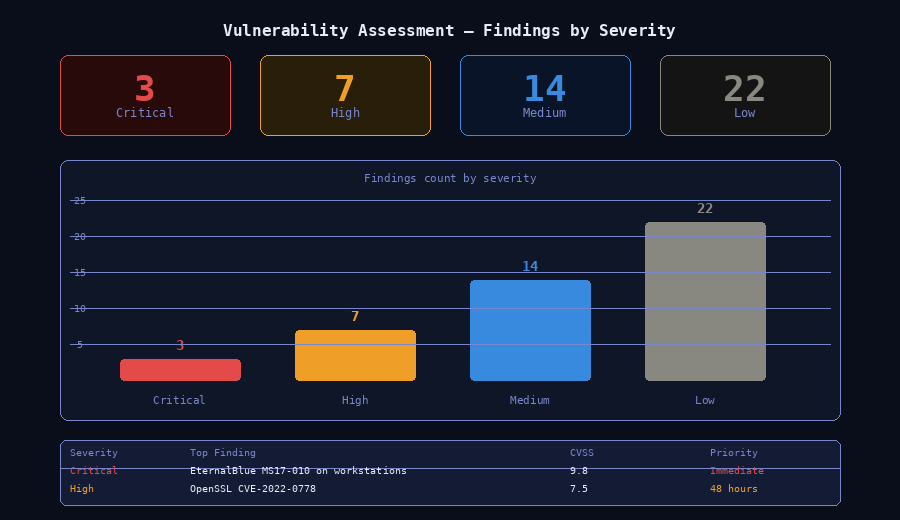

# 02 — Vulnerability Assessment Lab

**Analyst:** Alejandro Garcia (CyberJudoSec)  
**Tools:** Nmap · Nessus Essentials · OpenVAS  
**Skills:** Asset Discovery · Vulnerability Scanning · Risk Prioritization · Remediation Planning  
**Difficulty:** Intermediate  

---

## Scenario

A simulated small business environment with 12 assets across two network segments needed a vulnerability assessment. The environment had not been formally assessed in over 18 months. The objective was to identify, analyze, and prioritize vulnerabilities across the environment and produce both an executive summary and a technical remediation report.

---

## Objective

- Discover all active assets on the network
- Identify vulnerabilities using automated scanning tools
- Prioritize findings by severity using CVSS scoring
- Produce actionable remediation recommendations
- Deliver an executive summary and technical report

---

## Tools Used

| Tool | Purpose |
|---|---|
| Nmap | Asset discovery and port scanning |
| Nessus Essentials | Vulnerability scanning |
| CVE Database | Vulnerability cross-reference |
| VirtualBox | Lab environment |

---

## Environment

| Asset | OS | Role |
|---|---|---|
| 192.168.1.1 | pfSense | Firewall/Router |
| 192.168.1.10 | Windows Server 2019 | Domain Controller |
| 192.168.1.11 | Windows Server 2019 | File Server |
| 192.168.1.20 | Ubuntu 22.04 | Web Server |
| 192.168.1.21 | Ubuntu 22.04 | Database Server |
| 192.168.1.30-35 | Windows 10 | Workstations (x6) |

---

## Steps Performed

### 1. Asset Discovery
```bash
nmap -sn 192.168.1.0/24 -oN discovery-scan.txt
```
Identified 12 live hosts. Compared against expected asset inventory — 1 unknown host discovered at 192.168.1.99.

### 2. Port and Service Scan
```bash
nmap -sV -sC -O -p- 192.168.1.0/24 -oN full-scan.txt
```
Identified open ports, running services, and OS versions across all hosts.

### 3. Vulnerability Scan
Loaded asset list into Nessus Essentials. Ran credentialed scan against all hosts. Scan duration: 47 minutes.

### 4. Finding Review and Prioritization
Exported findings. Categorized by CVSS score:
- Critical (9.0–10.0)
- High (7.0–8.9)
- Medium (4.0–6.9)
- Low (0.1–3.9)

### 5. Report Generation
Produced executive summary and technical remediation report.

---

## Findings Summary

| Severity | Count | Top Finding |
|---|---|---|
| Critical | 3 | EternalBlue (MS17-010) on Windows workstations |
| High | 7 | Unpatched OpenSSL on Ubuntu web server |
| Medium | 14 | Default credentials on pfSense admin panel |
| Low | 22 | Missing security headers on web server |



*46 total findings across 12 assets — 3 Critical including EternalBlue on 6 workstations and default credentials on the perimeter firewall.*


---

## Critical Findings Detail

### CVE-2017-0144 — EternalBlue (MS17-010)
- **Asset:** 192.168.1.30–35 (Workstations)
- **CVSS:** 9.8
- **Description:** SMBv1 enabled. Remote code execution possible without authentication.
- **Remediation:** Disable SMBv1. Apply MS17-010 patch immediately. Isolate affected hosts.

### CVE-2022-0778 — OpenSSL Infinite Loop
- **Asset:** 192.168.1.20 (Web Server)
- **CVSS:** 7.5
- **Description:** Parsing a malformed certificate triggers infinite loop — denial of service.
- **Remediation:** Update OpenSSL to 1.1.1n or 3.0.2+.

### Default Credentials — pfSense Admin
- **Asset:** 192.168.1.1
- **CVSS:** 9.1
- **Description:** Admin panel accessible with default admin/pfsense credentials.
- **Remediation:** Change credentials immediately. Restrict admin panel to management VLAN only.

---

## Executive Summary

The assessment identified **3 critical**, **7 high**, **14 medium**, and **22 low** severity vulnerabilities across 12 assets. The most significant risk is the presence of EternalBlue on 6 workstations — a known ransomware vector. Immediate remediation of the top 3 critical findings would significantly reduce the environment's attack surface. A full patching cycle and credential audit is recommended within 30 days.

---

## Remediation Priorities

| Priority | Action | Timeline |
|---|---|---|
| 1 | Patch EternalBlue on all workstations | Immediate |
| 2 | Change pfSense default credentials | Immediate |
| 3 | Update OpenSSL on web server | Within 48 hours |
| 4 | Patch remaining High findings | Within 7 days |
| 5 | Address Medium findings | Within 30 days |
| 6 | Resolve Low findings | Next maintenance window |

---

## What I Learned

- Credentialed scans produce significantly more accurate results than uncredentialed scans
- Default credentials are consistently one of the most common and easily exploitable findings
- CVSS scores alone don't tell the full story — asset criticality and exploitability in context must factor into prioritization
- Separating executive and technical reports makes findings actionable for different audiences

---

## Files

```
02-vulnerability-assessment/
├── README.md               ← This file
├── scans/                  ← Nmap and Nessus output files
├── report/                 ← Executive summary and technical report
└── remediation.md          ← Detailed remediation steps
```
