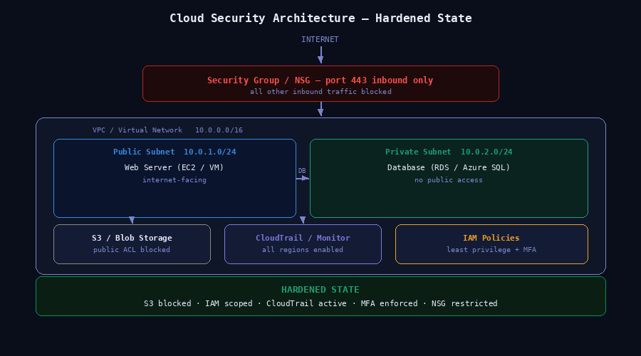

# 05 — Cloud Security Lab

**Analyst:** Alejandro Garcia (CyberJudoSec)  
**Tools:** AWS · Microsoft Azure · IAM · CloudTrail · Azure Monitor  
**Skills:** Cloud Security · IAM Hardening · Storage Security · Logging · Network Security Groups  
**Difficulty:** Intermediate–Advanced  

---

## Scenario

A simulated small remote business migrated its infrastructure to AWS and Azure without dedicated security review. The environment had several misconfigurations introduced during rapid deployment — overly permissive IAM policies, publicly exposed storage, and inadequate logging. The objective was to assess the current state, identify risks, and harden the environment to a reasonable security baseline.

---

## Objective

- Identify IAM misconfigurations and over-permissive policies
- Harden public-facing storage buckets and blob containers
- Enable and validate cloud logging and monitoring
- Document internet-facing vs private assets
- Produce a hardening report with before-and-after state

---

## Tools Used

| Tool | Purpose |
|---|---|
| AWS IAM | Policy review and hardening |
| AWS S3 | Storage hardening |
| AWS CloudTrail | Activity logging |
| AWS Security Hub | Findings aggregation |
| Azure IAM / Entra ID | Role assignment review |
| Azure Blob Storage | Container hardening |
| Azure Monitor | Log analytics and alerting |
| Azure Defender for Cloud | Security posture assessment |

---

## Environment

```
AWS Environment
├── VPC (10.0.0.0/16)
│   ├── Public Subnet (10.0.1.0/24)  ← Web server (EC2)
│   └── Private Subnet (10.0.2.0/24) ← Database (RDS)
├── S3 Buckets
│   ├── company-public-assets     ← Intentionally public
│   └── company-internal-backups  ← Should be private
└── IAM
    ├── admin-user (over-permissive)
    └── app-service-account

Azure Environment
├── Resource Group: prod-rg
│   ├── VM (Web Server)
│   └── Storage Account
└── Azure AD / Entra ID
    └── Service Principals
```

---

## Findings and Hardening Steps

### Finding 1 — S3 Bucket Public Access (Critical)

**Before:**
```
company-internal-backups:
  Block Public Access: DISABLED
  Bucket Policy: s3:GetObject → Principal: *
```

**After:**
```bash
aws s3api put-public-access-block \
  --bucket company-internal-backups \
  --public-access-block-configuration \
  "BlockPublicAcls=true,IgnorePublicAcls=true,\
   BlockPublicPolicy=true,RestrictPublicBuckets=true"
```
**Result:** Bucket no longer accessible without authentication ✅

---

### Finding 2 — Over-Permissive IAM Policy (High)

**Before:**
```json
{
  "Effect": "Allow",
  "Action": "*",
  "Resource": "*"
}
```
Admin user had AdministratorAccess attached with no MFA requirement.

**After:**
- Replaced with least-privilege policy scoped to required services
- Added MFA condition:
```json
{
  "Condition": {
    "BoolIfExists": {
      "aws:MultiFactorAuthPresent": "true"
    }
  }
}
```
**Result:** Privilege reduced, MFA enforced ✅

---

### Finding 3 — CloudTrail Not Enabled (High)

**Before:** No CloudTrail trail active in us-east-1.

**After:**
```bash
aws cloudtrail create-trail \
  --name prod-audit-trail \
  --s3-bucket-name company-cloudtrail-logs \
  --is-multi-region-trail \
  --enable-log-file-validation
aws cloudtrail start-logging --name prod-audit-trail
```
**Result:** All API calls now logged across all regions ✅

---

### Finding 4 — Azure Blob Container Public Access (High)

**Before:** Storage account had `Allow Blob Public Access: Enabled`

**After:**
```bash
az storage account update \
  --name prodstorageacct \
  --resource-group prod-rg \
  --allow-blob-public-access false
```
**Result:** All containers require authenticated access ✅

---

### Finding 5 — No Azure Monitor Alerts (Medium)

Configured Azure Monitor alerts for:
- Sign-ins from outside approved countries
- Role assignment changes
- Storage access from unknown IPs
- VM start/stop events

---

## Before vs After Security Posture

| Control | Before | After |
|---|---|---|
| S3 Public Access | Exposed | Blocked |
| IAM Least Privilege | Wildcard (*) | Scoped |
| MFA Enforcement | None | Required |
| CloudTrail Logging | Disabled | Enabled (multi-region) |
| Azure Blob Access | Public | Private |
| Azure Monitoring | None | Alerts configured |

---

## Architecture Diagram

```
Internet
    │
[Security Group / NSG — Port 443 only inbound]
    │
[Public Subnet — Web Server EC2]
    │
[Private Subnet — RDS Database]    [S3 — Private Bucket]
    │
[VPC Flow Logs → CloudTrail → S3 Audit Bucket]
```




*Hardened AWS/Azure architecture — public S3 access blocked, IAM scoped to least privilege, CloudTrail enabled across all regions, NSG restricted to port 443 inbound.*


---

## What I Learned

- Misconfigured S3 buckets and IAM policies are consistently the top cloud security risks — and they are easy to introduce during rapid deployments
- Enabling CloudTrail and Azure Monitor should be the first action in any cloud environment — you cannot investigate what you cannot see
- Least privilege IAM is not just about removing permissions — it's about understanding what each identity actually needs to function
- Cloud security misconfigurations are often invisible until you actively look for them with a security mindset

---

## Files

```
05-cloud-security-lab/
├── README.md               ← This file
├── diagrams/               ← Architecture diagrams
├── configs/                ← IAM policies, CloudTrail config
└── findings.md             ← Detailed findings and evidence
```
