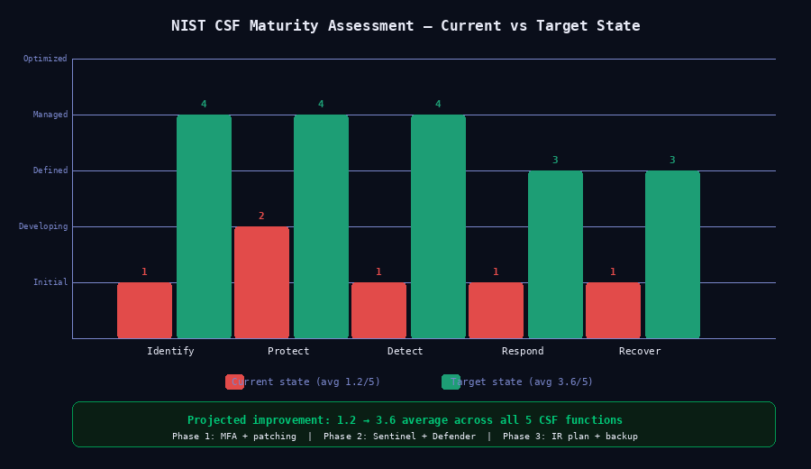

# 06 — NIST Security Architecture Case Study

**Analyst:** Alejandro Garcia (CyberJudoSec)  
**Framework:** NIST CSF · NIST SP 800-53  
**Skills:** Security Architecture · Risk Assessment · Control Mapping · Policy Design · Compliance  
**Difficulty:** Advanced  

---

## Scenario

A 50-person hybrid company — 30 office workers and 20 remote employees — needed a security architecture review. The company handles sensitive client data, uses a mix of on-premises servers and cloud services, and has no formal security program. The objective was to design a secure hybrid network architecture aligned to NIST CSF, map appropriate controls, and produce an implementation priority roadmap.

---

## Objective

- Assess the current environment against NIST CSF functions
- Design a target secure architecture for a 50-user hybrid environment
- Map NIST SP 800-53 controls to identified risks
- Produce implementation priorities and policy recommendations

---

## Business Context

| Factor | Detail |
|---|---|
| Size | 50 users (30 on-prem, 20 remote) |
| Data | Sensitive client PII and financial records |
| Cloud | Microsoft 365 + Azure hosting |
| On-Premises | 1 file server, 1 domain controller, VOIP |
| Remote Access | VPN (no MFA) |
| Current Security | Antivirus only, no SIEM, no MFA |

---

## Current State Assessment — NIST CSF

| Function | Maturity (1–5) | Key Gaps |
|---|---|---|
| Identify | 1 | No asset inventory, no risk register |
| Protect | 2 | No MFA, no network segmentation, no DLP |
| Detect | 1 | No SIEM, no log monitoring |
| Respond | 1 | No incident response plan |
| Recover | 1 | No tested backup or recovery plan |

**Overall Maturity: 1.2 / 5 — Significant gaps across all functions**




*Current maturity score 1.2/5 across all 5 CSF functions — projected improvement to 3.6/5 following phased implementation of controls.*


---

## Risk Assessment

| Risk | Likelihood | Impact | Priority |
|---|---|---|---|
| Stolen credentials — no MFA | High | Critical | 1 |
| Ransomware via unpatched endpoints | High | Critical | 1 |
| Data exfiltration — no DLP | Medium | High | 2 |
| Insider threat — no monitoring | Medium | High | 2 |
| Remote access compromise — no MFA on VPN | High | High | 1 |
| No incident response capability | High | High | 2 |

---

## Target Architecture Design

### Network Segmentation

```
Internet
    │
[Perimeter Firewall — pfSense / Azure Firewall]
    │
┌───────────────────────────────────────────┐
│  VLAN 10 — User Workstations              │
│  VLAN 20 — Servers (DC, File Server)      │
│  VLAN 30 — VoIP                           │
│  VLAN 99 — Management                     │
└───────────────────────────────────────────┘
    │
[Azure AD / Entra ID — Identity Layer]
    │
[Microsoft 365 — Cloud Productivity]
    │
[Remote Users → Azure VPN + MFA → User VLAN]
```

### Identity Architecture

- Azure Entra ID as identity provider
- MFA enforced for all users (Authenticator App)
- Conditional Access: Block legacy auth protocols
- Privileged Identity Management (PIM) for admin roles
- SSO for all SaaS applications via SAML/OAuth

### Detection Architecture

- Microsoft Sentinel as SIEM
- Defender for Endpoint on all workstations
- Defender for Identity on Domain Controller
- Azure Monitor for cloud resource logging
- Weekly log review cadence + automated alerts

---

## NIST SP 800-53 Control Mapping

| Control Family | Control ID | Control | Implementation |
|---|---|---|---|
| Access Control | AC-2 | Account Management | Azure Entra ID + PIM |
| Access Control | AC-17 | Remote Access | Azure VPN + MFA |
| Identification & Auth | IA-2 | MFA | Microsoft Authenticator |
| Identification & Auth | IA-5 | Authenticator Management | Password policy + expiry |
| Audit & Accountability | AU-2 | Event Logging | Microsoft Sentinel |
| Audit & Accountability | AU-6 | Audit Review | Weekly review + alerts |
| Configuration Management | CM-6 | Configuration Settings | Defender baselines |
| Incident Response | IR-4 | Incident Handling | IR plan + runbooks |
| Contingency Planning | CP-9 | System Backup | Azure Backup + test schedule |
| System Protection | SI-3 | Malware Protection | Defender for Endpoint |

---

## Implementation Roadmap

### Phase 1 — Immediate (Week 1–2)
- [ ] Enable MFA for all users
- [ ] Block legacy authentication protocols
- [ ] Patch all systems — priority on Critical/High CVEs
- [ ] Change all default credentials

### Phase 2 — Short Term (Month 1)
- [ ] Deploy Microsoft Sentinel
- [ ] Enable Defender for Endpoint on all workstations
- [ ] Implement VLAN segmentation
- [ ] Enforce Conditional Access policies

### Phase 3 — Medium Term (Month 2–3)
- [ ] Implement PIM for admin roles
- [ ] Configure DLP policies in Microsoft 365
- [ ] Enable Azure Backup and test recovery
- [ ] Develop and test Incident Response Plan

### Phase 4 — Ongoing
- [ ] Weekly log review
- [ ] Quarterly vulnerability scans
- [ ] Annual security awareness training
- [ ] Annual architecture review

---

## Policy Recommendations

1. **Acceptable Use Policy** — Define permitted use of company systems and data
2. **Remote Work Security Policy** — VPN required, MFA required, no public WiFi without VPN
3. **Incident Response Policy** — Define severity levels, escalation paths, communication plan
4. **Data Classification Policy** — Label sensitive data, define handling requirements
5. **Password Policy** — Minimum 16 characters, no reuse, MFA always required

---

## Target State Assessment — NIST CSF (Post-Implementation)

| Function | Current | Target | Controls Applied |
|---|---|---|---|
| Identify | 1 | 4 | Asset inventory, risk register |
| Protect | 2 | 4 | MFA, segmentation, DLP, patching |
| Detect | 1 | 4 | Sentinel, Defender, log monitoring |
| Respond | 1 | 3 | IR plan, runbooks, defined escalation |
| Recover | 1 | 3 | Tested backup, recovery procedures |

---

## What I Learned

- NIST CSF provides a practical language for communicating security posture to business stakeholders — maturity scores are more intuitive than control lists for non-technical audiences
- Most small organizations fail at Identify and Detect before anything else — you cannot protect what you cannot see
- MFA alone would close the majority of credential-based attack vectors in this scenario
- Phased implementation plans are essential for small organizations with limited resources — trying to do everything at once leads to nothing getting done

---

## Files

```
06-nist-security-architecture/
├── README.md               ← This file
├── diagrams/               ← Architecture diagrams
└── control-mapping.md      ← Full NIST 800-53 control mapping
```
