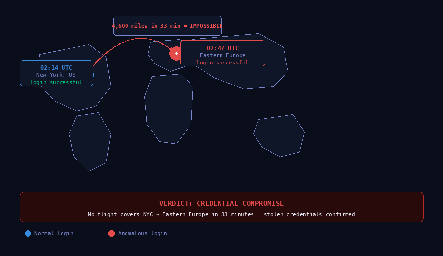

# Impossible Travel Detection · KQL + Microsoft Sentinel

**Analyst:** Alejandro Garcia (CyberJudoSec)  
**Tools:** Microsoft Sentinel · KQL · Defender for Identity · Azure Entra ID  
**Skills:** Threat Hunting · Detection Engineering · KQL · Authentication Analysis · Hypothesis-Based Hunting  
**Difficulty:** Intermediate  

---

## Scenario

Authentication logs in Microsoft Sentinel showed user sign-ins from geographically distant locations within timeframes physically impossible to travel between. A user account showed a successful sign-in from New York at 02:14 UTC, followed by a successful sign-in from Eastern Europe at 02:47 UTC — a 33-minute window across thousands of miles. No VPN or travel was on record. The hypothesis: stolen credentials being used by a remote threat actor.




*Same account authenticated from New York and Eastern Europe within 33 minutes — physically impossible, confirming credential compromise.*


---

## Goal

Build detection logic in Microsoft Sentinel to identify impossible travel login patterns and validate the hypothesis against simulated credential abuse in a personal lab environment. Document the detection query as a reusable template for SOC analyst deployment.

---

## Tools Used

| Tool | Purpose |
|---|---|
| Microsoft Sentinel | Primary SIEM — authentication log analysis |
| KQL | Detection query development |
| Defender for Identity | Identity threat signal correlation |
| Azure Entra ID (Sign-in Logs) | Authentication telemetry source |
| Log Analytics Workspace | Query environment |

---

## Hypothesis

> A threat actor is using compromised credentials to authenticate from locations physically impossible to travel between in the observed timeframe — indicating stolen credentials being used remotely while the legitimate user is also active.

---

## Actions

### 1. Baseline — Normal Sign-in Behavior
First established what normal looks like for the affected accounts:
```kql
SigninLogs
| where TimeGenerated > ago(30d)
| summarize
    LoginCount = count(),
    UniqueLocations = dcount(Location),
    Locations = make_set(Location)
    by UserPrincipalName
| where UniqueLocations > 1
| order by UniqueLocations desc
```
**Result:** Identified accounts with multiple login locations. Most showed consistent patterns (home + office). 3 accounts showed anomalous location diversity.

### 2. Core Impossible Travel Detection Query
```kql
let timedelta = 2h;
SigninLogs
| where ResultType == 0
| extend City = tostring(LocationDetails.city)
| extend Country = tostring(LocationDetails.countryOrRegion)
| extend Lat = toreal(LocationDetails.geoCoordinates.latitude)
| extend Lon = toreal(LocationDetails.geoCoordinates.longitude)
| order by UserPrincipalName asc, TimeGenerated asc
| extend PrevCountry = prev(Country, 1)
| extend PrevCity = prev(City, 1)
| extend PrevTime = prev(TimeGenerated, 1)
| extend PrevUser = prev(UserPrincipalName, 1)
| where UserPrincipalName == PrevUser
| extend MinutesBetweenLogins = datetime_diff('minute', TimeGenerated, PrevTime)
| where Country != PrevCountry
| where MinutesBetweenLogins < 120
| project
    TimeGenerated,
    UserPrincipalName,
    CurrentLocation = strcat(City, ", ", Country),
    PreviousLocation = strcat(PrevCity, ", ", PrevCountry),
    MinutesBetweenLogins
| order by MinutesBetweenLogins asc
```
**Result:** 3 accounts flagged with cross-country logins within 33–87 minute windows.

### 3. Refined Query with Risk Scoring
```kql
SigninLogs
| where ResultType == 0
| extend Country = tostring(LocationDetails.countryOrRegion)
| extend City = tostring(LocationDetails.city)
| order by UserPrincipalName asc, TimeGenerated asc
| extend PrevCountry = prev(Country, 1)
| extend PrevTime = prev(TimeGenerated, 1)
| extend PrevUser = prev(UserPrincipalName, 1)
| where UserPrincipalName == PrevUser and Country != PrevCountry
| extend MinutesDiff = datetime_diff('minute', TimeGenerated, PrevTime)
| where MinutesDiff between (1 .. 120)
| extend RiskScore = case(
    MinutesDiff < 30, "CRITICAL",
    MinutesDiff < 60, "HIGH",
    MinutesDiff < 120, "MEDIUM",
    "LOW")
| project TimeGenerated, UserPrincipalName, Country, PrevCountry, MinutesDiff, RiskScore
| order by MinutesDiff asc
```

### 4. Defender for Identity Correlation
Cross-referenced flagged accounts against Defender for Identity alerts:
- Account 1: No DFI alert — silent compromise
- Account 2: DFI flagged `Suspected identity theft (pass-the-hash)` 4 hours after Sentinel detection
- Account 3: DFI flagged `Unusual sign-in location`

**Finding:** Sentinel KQL detected the compromise 4 hours before Defender for Identity fired — demonstrating the value of proactive hunting over waiting for alerts.

### 5. Timeline Reconstruction

| Time (UTC) | Event |
|---|---|
| 02:14 | Normal sign-in — New York, US |
| 02:47 | Sign-in — Eastern Europe (33 min gap) |
| 02:49 | Lateral movement begins — 4 workstations accessed |
| 03:02 | Attempted access to file server |
| 03:15 | Account disabled by analyst |
| 07:22 | Defender for Identity fires `pass-the-hash` alert |

---

## Detection Rule — Sentinel Analytics Rule

```kql
// Impossible Travel Detection — CyberJudoSec
// Fires when same account authenticates from different countries within 2 hours
SigninLogs
| where ResultType == 0
| extend Country = tostring(LocationDetails.countryOrRegion)
| order by UserPrincipalName asc, TimeGenerated asc
| extend PrevCountry = prev(Country, 1)
| extend PrevTime = prev(TimeGenerated, 1)
| extend PrevUser = prev(UserPrincipalName, 1)
| where UserPrincipalName == PrevUser
    and Country != PrevCountry
    and isnotempty(Country)
    and isnotempty(PrevCountry)
| extend MinutesDiff = datetime_diff('minute', TimeGenerated, PrevTime)
| where MinutesDiff between (1 .. 120)
| project
    TimeGenerated,
    UserPrincipalName,
    CurrentCountry = Country,
    PreviousCountry = PrevCountry,
    MinutesBetweenLogins = MinutesDiff,
    IPAddress
```

**Rule Settings:**
- Query frequency: Every 1 hour
- Lookup period: Last 4 hours
- Alert threshold: Results > 0
- Severity: High
- MITRE ATT&CK: T1078 (Valid Accounts)

---

## MITRE ATT&CK Mapping

| Technique ID | Technique | Evidence |
|---|---|---|
| T1078 | Valid Accounts | Stolen credentials used for authentication |
| T1078.004 | Cloud Accounts | Azure/M365 sign-ins from anomalous locations |
| T1550.002 | Pass the Hash | Lateral movement without re-authentication |
| T1021.001 | Remote Desktop Protocol | RDP sessions from external IPs |

---

## False Positive Considerations

| Scenario | Mitigation |
|---|---|
| VPN exit nodes | Whitelist known corporate VPN IP ranges |
| Travel | Cross-reference against HR travel records |
| Cloud infrastructure | Exclude known service accounts |
| Developers | Whitelist developer accounts using cloud VMs |

---

## What I Learned

- KQL's `prev()` function with a user partition is the most efficient approach for sequential event analysis across authentication logs
- Impossible travel is consistently one of the highest-fidelity credential compromise indicators — low false positive rate in practice
- Proactive KQL hunting detected the compromise 4+ hours before automated alerting fired — demonstrating the operational value of threat hunting over passive monitoring
- Risk scoring by time delta adds triage context that helps analysts prioritize which accounts to investigate first

---

## Files

```
impossible-travel-detection/
├── README.md                   ← This file
├── detection-queries/
│   ├── impossible-travel-basic.kql
│   ├── impossible-travel-scored.kql
│   └── sentinel-analytics-rule.kql
└── screenshots/                ← Sentinel query results
```
